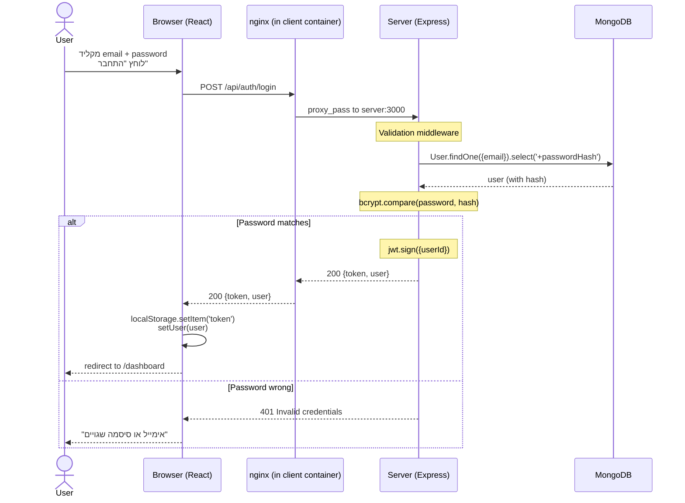

# 🏛 Architecture - ארכיטקטורת המערכת

## 🌐 High-Level Diagram

```
┌─────────────────────────────────────────────────────────┐
│                    משתמש / User                          │
│                  (דפדפן / Browser)                       │
└──────────────────────────┬──────────────────────────────┘
                           │
                           ▼  http://localhost (port 80)
┌─────────────────────────────────────────────────────────┐
│              Docker Desktop (host machine)              │
│                                                         │
│  ┌──────────────────────────────────────────────────┐   │
│  │         Client Container (nginx + React)          │   │
│  │                                                    │   │
│  │   ┌──────────────────────────────────────────┐    │   │
│  │   │  nginx config:                            │    │   │
│  │   │   /api/*  →  proxy_pass server:3000       │    │   │
│  │   │   /       →  index.html (React SPA)       │    │   │
│  │   └──────────────────────────────────────────┘    │   │
│  └──────────────────────┬───────────────────────────┘   │
│                         │                               │
│                         │ /api/* (internal)             │
│                         ▼                               │
│  ┌──────────────────────────────────────────────────┐   │
│  │         Server Container (Node + Express)         │   │
│  │                                                    │   │
│  │   ┌──────────┐  ┌────────────┐  ┌─────────────┐   │   │
│  │   │  Routes  │→ │ Validators │→ │ Controllers │   │   │
│  │   └──────────┘  └────────────┘  └─────┬───────┘   │   │
│  │                                       │            │   │
│  │                                       ▼            │   │
│  │                              ┌─────────────────┐   │   │
│  │                              │    Services     │   │   │
│  │                              │ (bcrypt, JWT,   │   │   │
│  │                              │  business logic)│   │   │
│  │                              └────────┬────────┘   │   │
│  │                                       │            │   │
│  │                                       ▼            │   │
│  │                              ┌─────────────────┐   │   │
│  │                              │  Mongoose Models│   │   │
│  │                              └────────┬────────┘   │   │
│  └───────────────────────────────────────┼───────────┘   │
│                                          │               │
│                                          ▼               │
│  ┌─────────────────────────────────────────────────┐    │
│  │      MongoDB Container (or Atlas Cloud)          │    │
│  │  Collections: users, surveys, responses          │    │
│  └─────────────────────────────────────────────────┘    │
└─────────────────────────────────────────────────────────┘
```

---

## 🔄 Request Flow Example - Login



---

## 🛡 Security Layers

### 1. Network Layer
- ה-server **לא חשוף** מבחוץ - רק nginx
- nginx על port 80 בלבד (לא יותר)

### 2. Authentication
- **JWT** - חתום עם secret, expires after 7 days
- Token in `Authorization: Bearer <token>` header

### 3. Password Storage
- **bcrypt** - hash + salt (10 rounds)
- `passwordHash` עם `select: false` - לא חוזר ב-API

### 4. Authorization
- **requireAuth middleware** - מוודא JWT תקין
- **Owner check** - לפני actions פרטיים (`survey.ownerId === req.user.id`)

### 5. Input Validation
- **Validators כ-middleware** - ולידציה לפני הגעה ל-controller
- בדיקת types, length, format

### 6. Error Handling
- **Global errorHandler** - תופס כל שגיאה
- **Consistent JSON error format** - `{ error: "..." }`

---

## 📐 Backend Architecture - 4 שכבות

```
HTTP Request
     │
     ▼
┌─────────────┐
│   Routes    │  ← הגדרת URL + middlewares chain
└──────┬──────┘
       │
       ▼
┌─────────────┐
│ Validators  │  ← בדיקת body/params (next() אם תקין)
└──────┬──────┘
       │
       ▼
┌─────────────┐
│ Controllers │  ← מקבל req/res, קורא ל-service, מחזיר תשובה
└──────┬──────┘
       │
       ▼
┌─────────────┐
│  Services   │  ← לוגיקה עסקית טהורה (bcrypt, jwt, חישובים)
└──────┬──────┘
       │
       ▼
┌─────────────┐
│   Models    │  ← Mongoose - מדבר עם DB
└──────┬──────┘
       │
       ▼
   MongoDB
```

### למה השכבות חשובות?

- **Single Responsibility** - כל קובץ אחראי על דבר אחד
- **Testability** - אפשר לבדוק כל שכבה בנפרד
- **Reusability** - service יכול להיקרא מ-CLI, GraphQL, או REST
- **Maintainability** - שינוי DB → רק models. שינוי URL → רק routes.

---

## 🐳 Docker Composition

### 3 Services

1. **mongo** - MongoDB 7 with persistent volume
2. **server** - Node + Express (no exposed ports!)
3. **client** - nginx + React build (port 80)

### Volume

- `mongo-data:/data/db` - DB persistence between restarts

### Networks

docker-compose creates a **default bridge network** automatically. Services communicate via service names (e.g., `server:3000`, `mongo:27017`).