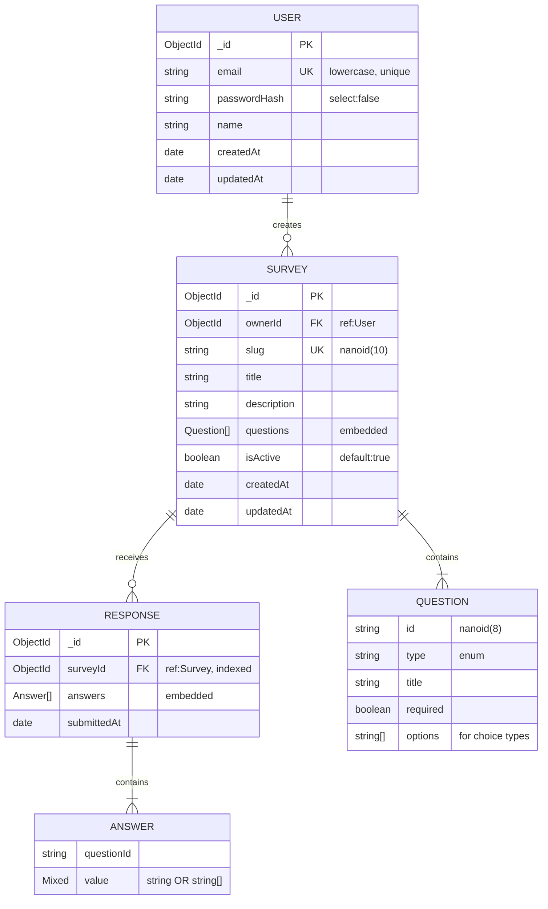

# 💾 Database Design - תרשים מסד הנתונים

## 🎯 בחירת מסד הנתונים: MongoDB

בחרנו ב-**MongoDB** (NoSQL Document) מהסיבות הבאות:

### 1. נתונים היררכיים
סקר מכיל **מערך של שאלות מקוננות**, ולכל שאלה יש שדות שונים (לדוגמה, `options` רק לסוגי בחירה). זה ממופה באופן טבעי למסמך JSON.

### 2. גמישות סכמה
לא צריך לבנות 3 טבלאות (Survey + Question + Option) ולעשות JOIN. הכל במסמך אחד.

### 3. JavaScript-native
מסמכי MongoDB הם JSON. ב-Node.js עובדים איתם בלי שכבת ORM מורכבת.

### 4. ביצועים
שליפה של סקר עם כל השאלות = **שאילתה אחת**.

---

## 📊 ERD - Entity Relationship Diagram



---

## 🗂 Collections

### 1. `users` (collection)

```javascript
{
    _id: ObjectId,
    email: "haim@example.com",        // unique, lowercase
    passwordHash: "$2b$10$...",        // bcrypt hash, select:false
    name: "Haim",
    createdAt: ISODate("..."),
    updatedAt: ISODate("...")
}
```

**Indexes:**
- `email` (unique)

---

### 2. `surveys` (collection)

```javascript
{
    _id: ObjectId,
    ownerId: ObjectId("..."),          // ref to users._id
    slug: "x7Bq9k2F",                  // nanoid(10), unique
    title: "שביעות רצון",
    description: "תן משוב",
    questions: [                        // embedded array
        {
            id: "q1abc",                // nanoid(8)
            type: "text",
            title: "שמך?",
            required: true
        },
        {
            id: "q2def",
            type: "single",
            title: "איך נהנית?",
            required: true,
            options: ["מעולה", "בסדר", "לא נהנית"]
        }
    ],
    isActive: true,
    createdAt: ISODate("..."),
    updatedAt: ISODate("...")
}
```

**Indexes:**
- `slug` (unique)
- `ownerId` (regular - for "my surveys" queries)

---

### 3. `responses` (collection)

```javascript
{
    _id: ObjectId,
    surveyId: ObjectId("..."),         // ref to surveys._id
    answers: [                          // embedded array
        { questionId: "q1abc", value: "דנה" },
        { questionId: "q2def", value: "מעולה" }
    ],
    submittedAt: ISODate("...")
}
```

**Indexes:**
- `surveyId` (regular - for "results of survey" queries)

---

## 🤔 שיקולי עיצוב חשובים

### Embedding vs Reference

| נתון | היכן נשמר | למה |
|------|-----------|-----|
| **questions** בתוך **survey** | Embedded | תמיד נקראים יחד, מוגבלים ל-~50 |
| **answers** בתוך **response** | Embedded | תמיד נקראים יחד עם ה-response |
| **responses** בקולקציה נפרדת | Referenced (ב-surveyId) | יכולים להיות אלפים, document size limit הוא 16MB |

### Cascade Delete

כשמוחקים סקר - גם כל ה-responses נמחקים:
```typescript
await SurveyResponse.deleteMany({ surveyId: survey._id })
await survey.deleteOne()
```

### Security: passwordHash
- שמור עם `select: false` - לא חוזר בשליפות רגילות
- חוזר רק עם `.select('+passwordHash')` (ב-login)

---

## 🔗 Relationships Summary

```
User (1) ────────── (N) Survey
                         │
                         ├─── contains many Questions (embedded)
                         │
                         └─── (1) ──── (N) Response
                                         │
                                         └─── contains many Answers (embedded)
```